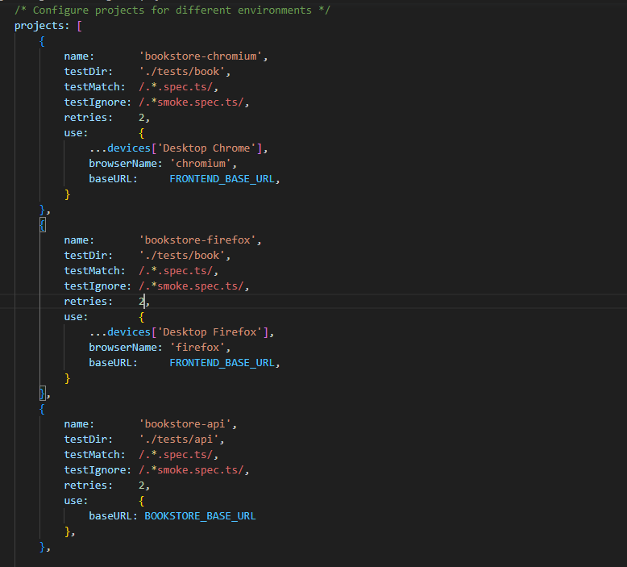
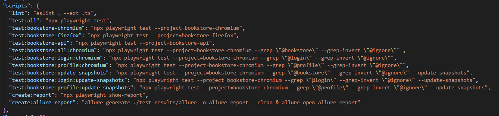

# PlaywrightFramework

Playwright TypeScript Automation Framework

## Playwright Introduction

* Playwright is a framework for Web Testing and Automation. It allows testing Chromium, Firefox and WebKit with a single API. Playwright is built to enable cross-browser web automation that is ever-green, capable, reliable and fast. Headless execution is supported for all browsers on all platforms.
* As Playwright is written by the creators of the Puppeteer, you would find a lot of similarities between them.
* Playwright has its own test runner for end-to-end tests, we call it Playwright Test.
* Cross-browser. Playwright supports all modern rendering engines including Chromium, WebKit, and Firefox.
* Cross-platform. Test on Windows, Linux, and macOS, locally or on CI, headless or headed.
* Cross-language. Use the Playwright API in TypeScript, JavaScript, Python, .NET, Java. The core framework is implemented using TypeScript.
* Playwright development is sponsored by Microsoft.

[GitHub](https://github.com/microsoft/playwright)
[Documentation](https://playwright.dev/docs/intro)
[API reference](https://playwright.dev/docs/api/class-playwright/)
[Changelog](https://github.com/microsoft/playwright/releases)
  
# Playwright - Framework

This is an automation framework using Playwright written in TypeScript.

## Framework Structure

```
non-bdd                                               //
├─ .editorconfig                                      //<This file is for unifying the coding style for different editors and IDEs
├─ .env                                               //<contains environment variables 
├─ .eslintignore                                      //<contains files, folders opted out from ESLint checking
├─ .eslintrc                                          //<contains ESLint rules
├─ .github                                            //
│  └─ workflows                                       //
│     └─ playwright.yml                               //<GitHub Actions file
├─ .gitignore                                         //<gitignore file
├─ __snapshots__                                      //<generated page snapshots
├─ azure-pipelines.yml                                //<Azure Pipeline file
├─ config                                             //<contains common configuration
│  ├─ default-screenshot-config.ts                    //<default screenshot configuration (capture full page, disable animations, etc)
│  └─ endpoints.ts                                    //<contains endpoints of the SUTs
├─ constants                                          //
│  ├─ api-constants.ts                                //<contains constant objects to be used in API Testing project
│  ├─ url-constants.ts                                //<contains constant objects of urls to be used in project
│  └─ placeholder-constants.ts                        //<a list of common placeholders to be used for generating test data (RANDOM_EMAIL, RANDOM_TEXT, etc)
├─ core                                               //<contains core helper functions, models, etc
│  ├─ api                                             //
│  │  ├─ api-request.ts                               //<Models for API request
│  │  └─ rest-client.ts                               //<REST API Client used for working with APIs
|  ├─ page                                            //
│  |  ├─ base.page.ts                                 //<Base Page Object 
|  |  └─ page.ts                                      //<contains general interface for page object
|  ├─ utils                                           //
|  ├─ csv-helper.ts                                   //<contains helper functions to handle CSV file (to be used for CSV data-driven test cases for example)
│  ├─ placeholder-helper.ts                           //<contains helper function to replace placeholders in the test data (placeholder pattern is defined in config/constants - $$PLACEHOLDER_PATTERN$$) 
│  └─ reflection-helper.ts                            //<contains helper functions to get class, object infos like recursively iterating and perform actions for each JSON object fields
├─ data                                               //<contains test data
│  ├─ auth.json                                       //<contains generated authenticated state (including session data, cookies, local storage) at test suite startup. this file can be consumed in test cases to bypass login operation - Applied for NOPCOMMERCE test suite
│  ├─ country-code.json                               //
│  ├─ frontend                                        //<Test data for NopCommerce page
│  │  └─ login-data.json                              //<Test data for NopCommerce Login page
├─ fixtures                                           //<contains Playwright fixtures
│  ├─ all.fixture.ts                                  //<contains combination of all fixtures
│  ├─ api.fixture.ts                                  //<contains all fixtures related to API Testing
│  ├─ base.fixture.ts                                 //<contains fixtures for Base classes (like base page object)
│  ├─ page.fixture.ts                                 //<contains fixtures related to page object
├─ helpers                                            //<contain helper functions, classes to work in some projects
│  ├─ api                                             //<contain helper functions, classes to work in API projects
│  │  ├─ account-api-helper.ts                        //<contain helper functions to work with BookStore Account API
│  |  ├─ api-header-helper.ts                         //<contain helper functions to work with BookStore Book API
│  |  └─ book-api-helper.ts                           //<contain helper functions to work with BookStore API
│  ├─ generators                                      //<contains test data generator functions
│  │  └─ text-generator.ts                            //<contain generator functions for text data type
├─ hooks                                              //
│  ├─ global-setup.ts                                 //globalSetup option file to set something up once before running all tests (for example: login to an account before running the test cases, seed test database with mock data, etc)
│  ├─ global-teardown.ts                              //<globalTeardown to run something once after all the tests (for example: reset user authenticated state, clear cookies, sessions, clean up test data in database etc)
│  ├─ setup-bookstore-api.ts                          //<functions for setting BookStore API test suite>
│  └─ setup-bookstore.ts                              //<functions for setting BookStore test suite>
├─ LICENSE                                            //
├─ models                                             //<business models of the SUT
│  ├─ business-models                                 //<business models of Bookstore page
   |  ├─ book                                         //
│  │  |  └─ login-info.ts                             //
│  │  └─ api                                          //
│  │     ├─ account-models.ts                         //
│  │     └─ book-models.ts                            //
├─ package-lock.json                                  //<provide an immutable version of package.json
├─ package.json                                       //<contains basic information about the project,registered dependencies and running script
├─ pages                                              //<contains page objects
│  ├─ bookdetail.page.ts                              //
│  ├─ bookstore.page.ts                               //
│  ├─ login.page.ts                                   //
│  ├─ profile.page.ts                                 //
├─ playwright.config.ts                               //<PlayWright configuration file
├─ README.md                                          //<Starting guideline
├─ reporters                                          //
│  ├─ custom_reporter.ts                              //<a sample for customized Playwright reporter
│  ├─ json-report-test-result.json                    //<a sample of generated json test report result 
│  └─ junit-report-test-result.xml                    //<a sample of generated JUnit test result
├─ tests                                              //
│  ├─ api                                             //<Test cases for BookStore API>
│  │  └─ get-user.spec.ts                             //
│  └─ book                                            //<Test cases for BookStore UI>
│     ├─ login.spec.ts                                //<Test cases of Bookstore Login feature applying POM + fixture
│     ├─ addbook.spec.ts                              //<Test cases of Bookstore Add Book feature applying POM + fixture
└─ tsconfig.json                                      //<The tsconfig.json file specifies the root files and the compiler options required to compile the project.

```

## Requirements

```
- Visual Code
- NodeJS version > 14 (Node.js 14 is no longer supported since it reached its end-of-life on April 30, 2023.)
- Playwright 1.32.3
```

# Getting Started

```
This is the quick and easy getting started assuming you already have git, Visual Code and NodeJS installed.
```

## Open project in Visual Code

```
- Launch Visual Code
- File -> Open Folder OR ctrl+K ctrl+O
- Select project root folder
```

## Install the required items

1. Install all required packages for project defined in the package.json file: Playwright, etc

```sh

Open Terminal window in Visual Code (ctrl + `) then execute command:
npm install

Or go to project root folder then open CMD windows and execute command:
npm install

```

2. Install Playwright Browsers

```sh

Open Terminal window in Visual Code (ctrl + `) then execute command:
npx playwright install

Or go to project root folder then open CMD windows and execute command:
npx playwright install

```

## Run Tests

### Run tests by Playwright VSCode extension

1. Install Playwright Test for VS Code extension on VS Code Marketplace (https://marketplace.visualstudio.com/items?itemName=ms-playwright.playwright)
2. You can run a single test by clicking the green triangle next to your test block to run your test. Playwright will run through each line of the test and when it finishes you will see a green tick next to your test block as well as the time it took to run the test.

3. You can also run your tests and show the browsers by selecting the option Show Browsers in the testing sidebar. Then when you click the green triangle to run your test the browser will open and you will visually see it run through your test. Leave this selected if you want browsers open for all your tests or uncheck it if you prefer your tests to run in headless mode with no browser open.


   
### Run tests on Chrome/Firefox (include BookStore test suite)

```sh
For Chrome, Execute the command in the terminal: 
npm run test:bookstore-chromium

For Firefox, Execute the command in the terminal: 
npm run test:bookstore-firefox
```

### Run API tests only (include BookStore API test suite)

```sh
Execute the command in the terminal: 
npm run test:bookstore-api
```

### Run tests by feature tags (including BookStore Login test suite)

```sh
Execute the command in the terminal: 
npm run test:bookstore:login:chromium
```

### Run tests to update snapshots (including BookStore test suite)

Used for Visual Testing purpose
On the first run of the test suite, the framework will capture the screenshots of the pages and stored it in the __snapshots__ directory as Base Snapshots
On the second run of the test suite, the framework will compare the captured screenshots with the based screenshots (compare pixel by pixel under the hood)

```sh
To update the Base Snapshot for NopCommerce test suite, Execute the command in the terminal: 
npm run test:bookstore:update-snapshots
```

Please see the package.json file for more details (note the --update-snapshots command option)

### Run tests in parallel

We can run test cases in parallel in two ways

Option #1: Modify the "workers" field in the playwright.config.ts page -> this option will affect all test suites

Option #2: Add --workers arguments in the test run commands (only affect for specific test run)

```sh
Run Login test suite with 2 workers
npm run test:bookstore:login:chromium -- --workers=<number-of-workers>
```

For more details, please refer to Playwright document
[Playwright Parallelism and sharding](https://playwright.dev/docs/test-parallel)


### Generate Report

```
After running test complete, we can execute the following command in Visual Code Terminal window or CMD window:
npm run create:report

The HTML report will be generated in folder TestReport in root folder

We can change the type of reporter (JUnit, customized, 3rd party reporter - Allure, etc) in the playwright.config.ts file

Execute this command for generating Allure report:
npm run create:allure-report
```

### Run Linting to check coding convention of all projects (by ESLint)

```sh
Execute the command in the terminal: 
npm run lint
```

### How to configure and run tests on different environment or browser
Playwright has many options to configure how your tests are run. You can specify these options in the configuration file. Therefore, we can configure the enviroment which we use to run test in Project section of configuration file like below:



In this sample, we configure 2 projects (1 for Chromium and 1 for Firefox) in order to run all tests on different browsers. We can also configure different baseURl for different Environments here.
Then, we can specify the scripts to run on multi environments on package.json file like below:


Finally, we can use npm run command to specify the enviroment that we want to run. For example, if we want to run all tests on Chromium we can use below command:
```sh
npm run test:bookstore-chromium
```
For more details, please refer to Playwright document
[Playwright Test Configuration](https://playwright.dev/docs/test-configuration)